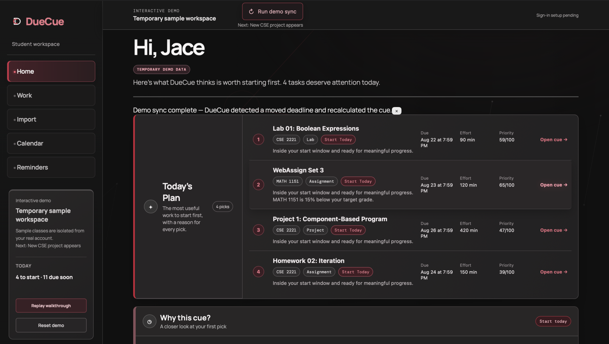
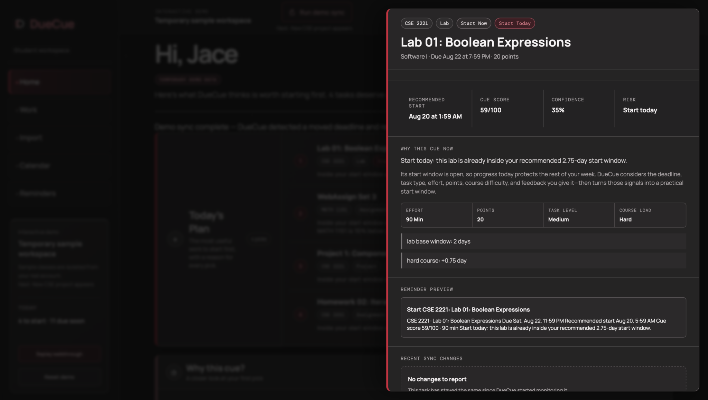
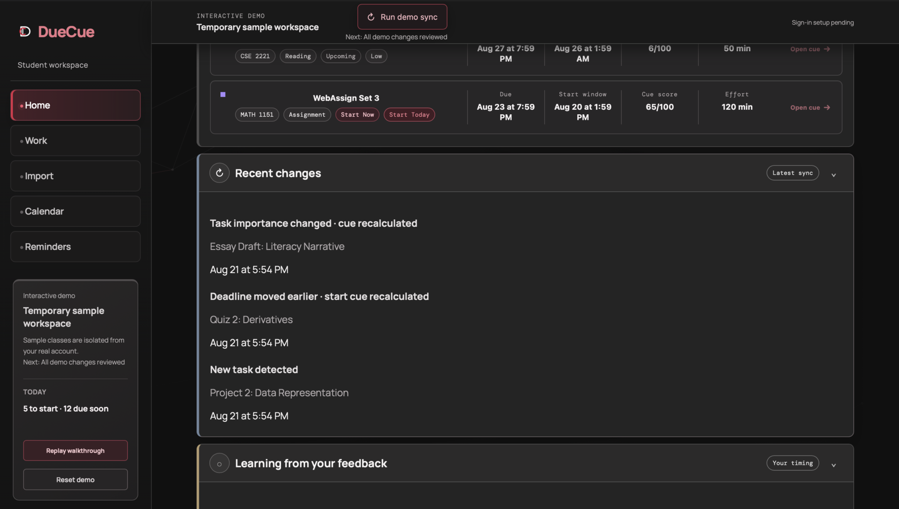
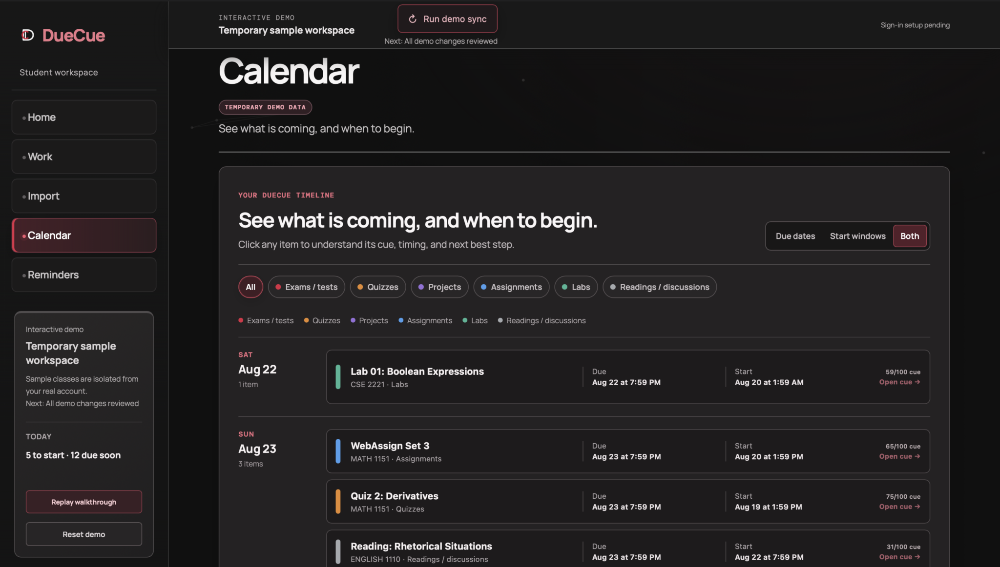
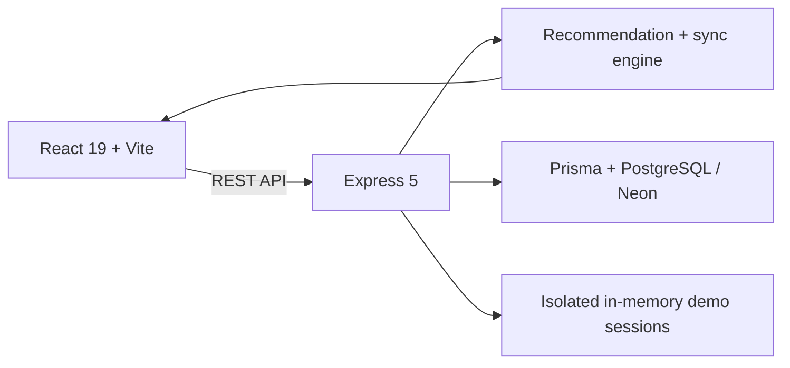

# DueCue

**An adaptive academic planning platform that recommends when students should start coursework—not merely when it is due.**

[Live Demo](https://due-cue-frontend.vercel.app) · [Repository](https://github.com/JJaaace/DueCue)



*The recruiter demo dashboard turns upcoming coursework into a ranked, explainable plan.*

DueCue is an independent portfolio project and is not affiliated with, endorsed by, or connected to The Ohio State University or CarmenCanvas.

## The Problem

Calendars are good at showing when assignments are due, but a due date alone does not tell a student when to begin. Work with the same deadline can demand very different amounts of time, and a manageable week can quickly become overloaded when several deadlines cluster together.

DueCue turns coursework into an actionable plan. It calculates useful start windows, ranks priorities, detects deadline changes and workload pileups, and adjusts future timing recommendations from student feedback—all while keeping the reasoning visible.

## Try the Demo

The public deployment is designed as a recruiter demo, and no signup is required. A first-time visitor enters an isolated demo session with realistic coursework and can:

- Inspect the next recommended task and the factors behind its timing.
- Explore upcoming work, calendar events, reminders, and task details.
- Mark recommendations as too early, about right, or too late.
- Run staged sync changes to see how DueCue reacts to a new assignment and a shifted deadline.

Each visitor receives separate demo state, so feedback and staged changes do not affect another visitor's session. The API runs on Render's free service and may take a short time to wake after inactivity.

## Product Tour

| Explainable task recommendations | Coursework change detection |
| --- | --- |
|  |  |
| Open any cue to inspect its timing, contributing factors, reminder preview, and feedback controls. | Review meaningful sync changes and see when DueCue recalculates the plan. |



*The calendar combines due dates and start windows in one filterable coursework timeline.*

## Key Features

- **Explainable recommended start windows** — Suggests when to begin and shows the due-date pressure, task size, course context, and workload factors behind the recommendation.
- **Cue score and priority ranking** — Converts timing and workload signals into a sortable score so the most useful next action is easy to find.
- **Deadline-change and workload-pileup detection** — Surfaces changed dates and clustered deadlines before they become surprises.
- **Feedback-driven timing adjustments** — Uses “too early,” “about right,” and “too late” feedback to tune future recommendations for that student.
- **Coursework import** — Supports iCal/ICS calendar-feed imports and a documented manual JSON format without scraping a learning-management system.
- **Calendar and reminder tools** — Provides a connected calendar feed, one-time calendar export, and reminder previews tied to recommendation timing.
- **Isolated recruiter demo** — Gives every anonymous visitor temporary state and a staged sync sequence for evaluating the product safely.

## How Recommendations Work

DueCue uses a deterministic planning model rather than presenting its recommendations as AI. The engine evaluates concrete inputs such as due date, task type, estimated effort, course priority, nearby workload, recent deadline changes, grade-goal context, and the student's prior timing feedback.

From those inputs it produces a recommended start time, a cue score, a confidence level, an explanation, and reminder timing. The same stored inputs produce the same result, while explicit feedback changes the student's timing adjustment for later recommendations. This makes each recommendation inspectable and testable instead of opaque.

## Architecture



The frontend is deployed on Vercel and communicates with the Render-hosted API. Persistent application data is modeled through Prisma and PostgreSQL; the public recruiter demo uses separate, temporary in-memory sessions. Public demo routes and authenticated owner routes are intentionally distinct boundaries.

For data flow, route boundaries, deployment configuration, and security details, see [Architecture](docs/ARCHITECTURE.md) and [Deployment](docs/DEPLOYMENT.md).

## Technology

| Layer | Technology |
| --- | --- |
| Frontend | React 19, TypeScript, Vite |
| API | Express 5, TypeScript |
| Data | Prisma, PostgreSQL / Neon |
| Hosting | Vercel, Render |

The interface uses a custom responsive design system and motion treatment built in the application code. The recommendation and sync behavior are implemented as domain logic that can be exercised independently of the UI.

## Local Setup

### Prerequisites

- Node.js 20 or newer
- npm
- PostgreSQL, or a Neon connection string

Clone the repository and install dependencies:

```bash
git clone https://github.com/JJaaace/DueCue.git
cd DueCue
npm install
```

Create local environment files from the supplied examples:

```bash
cp backend/.env.example backend/.env
cp frontend/.env.example frontend/.env
```

Set a valid `DATABASE_URL`, then prepare the database and start both applications:

```bash
npm run db:migrate
npm run db:seed
npm run dev
```

The frontend normally runs at `http://localhost:5173`; the API normally runs at `http://localhost:4000`. Environment requirements differ between local development, the anonymous demo, and authenticated deployments, so consult the [deployment guide](docs/DEPLOYMENT.md) before configuring a hosted environment.

## Commands

Run these from the repository root:

| Command | Purpose |
| --- | --- |
| `npm run dev` | Start the frontend and backend development servers |
| `npm run build` | Build all workspaces for production |
| `npm test` | Run the backend test suite |
| `npm run test --workspace=frontend` | Run the frontend test suite |
| `npm run db:migrate` | Apply local Prisma migrations |
| `npm run db:seed` | Reset and seed the local demo workspace |

## Testing

The project includes frontend component and interaction tests, backend route tests, recommendation-engine coverage, public-demo session tests, authentication-boundary checks, and import/sync behavior tests. Before opening a pull request, run:

```bash
npm run test --workspace=backend
npm run test --workspace=frontend
npm run build
git diff --check
```

## Documentation

- [Architecture and data flow](docs/ARCHITECTURE.md)
- [Deployment and environment configuration](docs/DEPLOYMENT.md)
- [Recruiter demo walkthrough](docs/DEMO_SCRIPT.md)
- [Manual import format](docs/IMPORT_FORMAT.md)
- [Product roadmap](docs/ROADMAP.md)

## Current Limitations

- The public deployment is currently a recruiter demo, not a production student service.
- Real Canvas OAuth is not implemented. Current coursework ingestion uses calendar feeds, manual imports, or staged demo data.
- Anonymous demo sessions are temporary and stored in memory; they can disappear when the API restarts or the session expires.
- Email delivery remains preview-only. DueCue can demonstrate reminder content and timing, but it does not send production email.
- Clerk integration exists in the codebase, but production Clerk authentication must not be considered active while the deployed Render service uses `AUTH_MODE=dev`.

These constraints are deliberate and visible so the demo represents what is implemented today. The roadmap and deployment documentation describe the path from the isolated recruiter experience to a durable authenticated product without overstating the current system.
